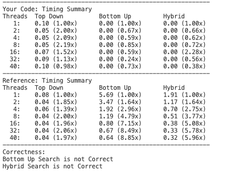

### 作业2 实验报告

1900012731 王一鸣

#### 任务2 并行加速top-down BFS

做法：在取队头结点的循环和进行扩展这两个循环都使用#pragma omp parallel for，并使用#pragma omp critical保护对于new_frontier的更新以及读取，使得new frontier的节点储存正常。

#### 任务3 实现并加速bottom-up BFS

在单线程上成功实现了bottom-up BFS，遗憾的是，它在grid1000x1000.graph以及更大的图上跑不通（超时），因而只能在此报告grid100x100.graph的结果。

加速：对遍历图上结点的大循环做并行加速，并使用critical pragma保护对于new_frontier的更新以及读取。

#### 任务4 实现hybrid BFS

做法：当frontier的size大于图节点个数的四分之一，则采用bottom-up BFS，反之则采用top-down BFS。

测试结果如下，为grid100x100.graph的结果。

可以看到，并行加速在top-down、hybrid都有效果，并且hybrid的耗时更少。然而，在bottom-up下的BFS，我实现的并行加速并没有明显效果。

#### 分析

* 关于top-down BFS的另一种加速尝试

使用#pragma omp ordered，这样可以省去对于临界区的竞争，缺点是执行顺序固定。

结果如下(在grid1000x1000.graph上测试)：

可以看到，加速比随线程的增加而减少，因为这样会导致越来越多的线程处于等待状态。

在random_1m.graph上的加速比就更差了：

不过，其运行时间还是比较优的。

* 关于bottom-up BFS的运行失败。

个人猜测是因为算法本身效率过低，当然也可能是我的实现(按照提供的伪代码实现)有可以优化的地方。

