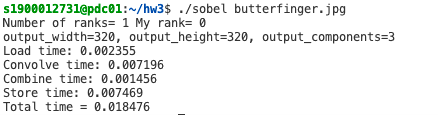
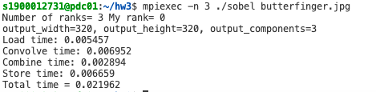
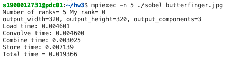
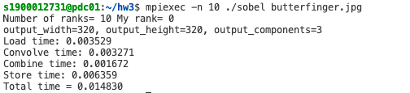
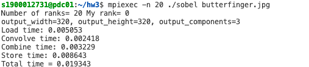
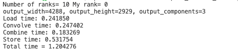
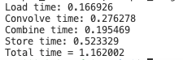
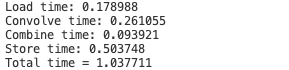

### 使用MPI并行加速Sobel算子

1900012731 王一鸣

#### 任务2 并行加速原算法

* 使用0号进程load图像，并通过broadcast的方式传图的长宽、颜色深度，之后将图像广播。

从结果来看，使用这种方式带来的加载开销反而会比每个进程单独加载要高，主要原因是引入了很多communicaiton的overhead。

* 修改generic_convolve，思路为根据进程rank按y进行划分，各自处理自己分到的部分y。由于每个进程保存了自己的一份图像，在最后还需要对其进行all-gather才能做后面的操作。

以下为在butterfinger.jpg上的结果，进程数依此为1、3、5、10、20.

可以看到convolve time是递减的，加速比不断增加。

### 进一步优化

这里我采用了三种优化

* 由上面的分析，令所有进程加载图像，会更加节省时间
* 并行加速combine函数，同样按y进行分割。
* 存储图像时，只令0号进程进行图像输出。(在时间上表现不明显)

以下分别为只优化3、优化1和3、三种优化的运行结果，为10进程的space_station_hires.jpg

