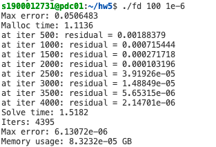

### 使用CUDA并行加速有限差分法求解二维拉普拉斯方程

1900012731 王一鸣

#### 测试并行版本的可扩展性

使用OpenMP作业中提供的CycleTimer代码计算运行时间。

通过运行串行版本的代码，发现N=500时运行时间便已经难以接受了(590+ 秒)。

观察Memory Usage发现，即使N=500的情况下也只使用了2MB左右的内存，远小于服务器的运行内存，说明是运行时间限制了程序进行更大规模的运算。

#### 利用CUDA在GPU上加速

代码思路：

核函数：进行有限差分法的核心逻辑，不在循环中处理，而是每个thread处理自己的一部分。

thread (i, j)需要访问的数据为u(i, j),u(i-1, j), u(i+1, j), u(i, j-1), u(i, j+1).

定义二维的block，每个block里装有16*16个thread 。注意边界thread的处理，坐标不在[1, N] $\times$ [1, N]的thread显式停止执行任务，否则会影响正确性。

加速后测试结果如下：

可以看到，在规模较小时优化效果反而不好，这是因为进行`cudaMalloc()`的时间占了大部分的处理时间。在问题规模逐渐变大后，并行加速的效果开始显现，在N=500时总运行时间缩短了大约75%。